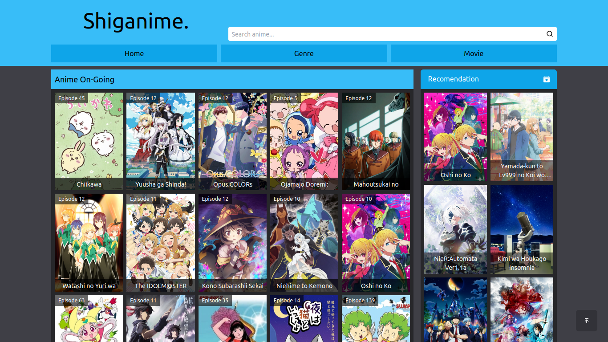

<h2 align="center">
  Shiganime - Streaming Anime Subtitle English  
</h2>

This website using public api from <a href='https://github.com/riimuru/gogoanime-api'>Gogoanime-api</a>

## Built With

<!-- My personal portfolio <a href="///" target="_blank">wait</a> which features some of my github projects as well as my resume and technical skills.  -->

This project was built using these technologies.

- React.js
- Tailwind Css
- Vite
- Vercel

## Getting Started

Clone down this repository. You will need `node.js` and `git` installed globally on your machine.

## 🛠 Installation and Setup Instructions

1. Clone this repository `git clone https://github.com/radityaseptian/shiganime.git`

2. Installation: `npm install`

3. In the project directory, you can run: `npm run dev`

Runs the app in the development mode.
Open [http://localhost:5173](http://localhost:5173) to view it in the browser.
The page will reload if you make edits.

## Usage Instructions

Open the project folder and Navigate to `/src/components/`.  
You will find all the components used and you can edit your information accordingly.
